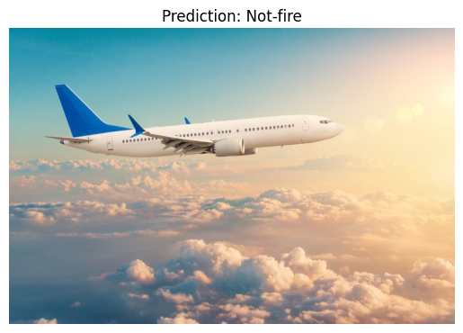
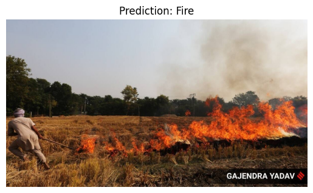
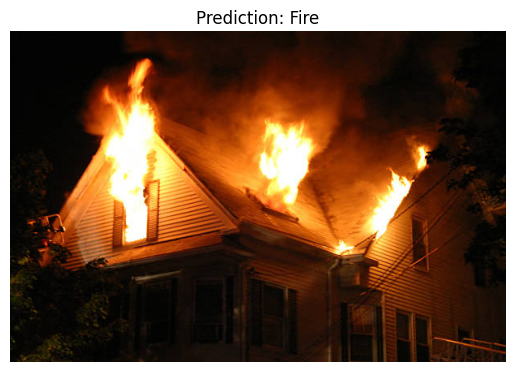
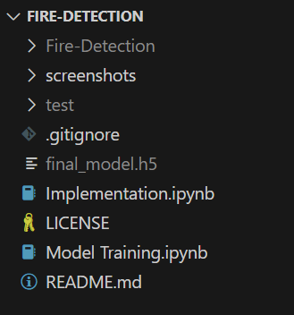

# Fire-Detection

This repository contains code for training and implementing a deep learning model for fire detection. The project consists of two main notebooks:

## Model Training

This notebook contains code for training the fire detection model. Here's what it does:

1. Loads the train dataset from the "Fire-Detection" folder. The dataset is obtained from [Kaggle](https://www.kaggle.com/datasets/atulyakumar98/test-dataset), where label 1 indicates fire and label 0 indicates normal.
2. Preprocesses the image data using TensorFlow's ImageDataGenerator.
3. Builds and compiles a neural network model using a pre-trained ResNet-50 architecture with additional dense layers.
4. Trains the model on the dataset for 100 epochs.
5. Saves the best model as "final_model.h5" in the project directory.

## Implementation

This notebook implements the trained fire detection model for inference on sample images. Here's what it does:

1. Loads the best model saved during training from "final_model.h5".
2. Defines functions for image preprocessing, prediction, and visualization.
3. Tests the model on sample images from the "test" folder obtained from [Kaggle](https://www.kaggle.com/datasets/jvkchaitanya410/fireornot-firetestset).
4. Displays the predictions for each sample image.

## Dataset Information

- **Train Dataset:** The train dataset is named "Fire-Detection" and you can download it from [Kaggle](https://www.kaggle.com/datasets/atulyakumar98/test-dataset). It contains images labeled as 1 for fire and 0 for normal. Save the "Fire-Detection" in your project root directory.
- **Test Dataset:** The test dataset is named "test" and you can download it from [Kaggle](https://www.kaggle.com/datasets/jvkchaitanya410/fireornot-firetestset). It contains images for testing the model.

## Model Performance

After training the model for 100 epochs, the model achieved the following performance metrics:

- **Loss:** 0.5400 (training), 0.4791 (validation)
- **Accuracy:** 0.8311 (training), 0.8308 (validation)

**Observations:**
- The training and validation losses are close to each other, indicating that the model is not overfitting.
- The model achieves a relatively high accuracy on both the training and validation sets, which suggests that it is effectively learning to distinguish between fire and non-fire images.
- The slight difference in loss and accuracy between the training and validation sets indicates that the model may still have room for improvement, but overall, it performs well on the given dataset.

These performance metrics suggest that the model has been trained effectively and has the potential to generalize well to new, unseen data. Further optimization and fine-tuning could potentially improve its performance even more.

## Model Output

Here are the predictions made by the trained fire detection model on sample images:

## Project Directory Structure

The screenshot above shows how the project directory should look like during implementation.

## Future Work

For future work, we aim to make the fire detection model real-time and explore training images captured from thermal cameras for better detection accuracy.
